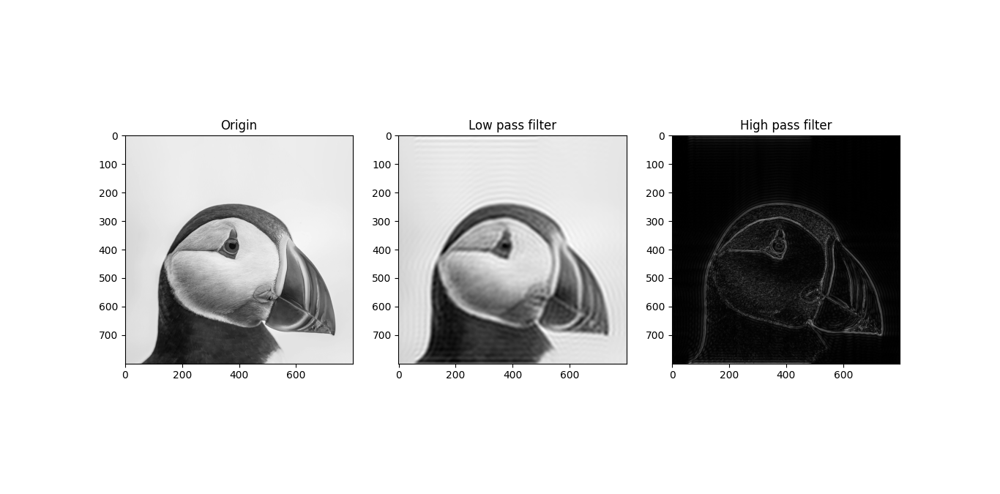

# Ringing effect
## Description
Ringing effect appeared as rippling artifact near sharp edges.  
It appears after filter (in bolt low pass and high pass) with high cutting level.

In the figure above, ringing effect appears after low pass filter and high pass filter with 10%.
## The reason
A signal being bandlimited (not having high frequencies) or passed through a low-pass filter;
## Solution
Using Gaussian window for filter to replace the rectangle filter